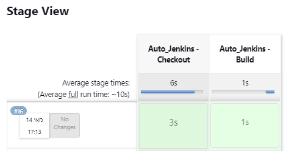

# Auto Deploy Jenkins with Pre-deploy Job Using Docker and Docker Compose

This project automates the deployment of a Jenkins server pre-configured with security settings and a sample job. By utilizing Docker and Docker Compose, it streamlines the setup process, enabling rapid deployment and consistent environments.


## Features

- **Automated Jenkins Deployment**: Leverages Docker Compose to build and run a Jenkins instance with predefined configurations.
- **Configuration as Code (CASC)**: Employs Jenkins Configuration as Code (CASC) to set up security realms, authorization strategies, and other essential settings.
- **Pre-configured Job**: Includes a sample SCM job that triggers upon a pull request to this Git repository and executes a Python script.

## Prerequisites

- **Docker**: Ensure Docker is installed on your system.
- **Docker Compose**: Verify that Docker Compose is installed.

## Getting Started

1. **Clone the Repository**:

   ```bash
   git clone https://github.com/Levi-Michael/auto-deploy-jenkins.git
   cd auto-deploy-jenkins
   ```

2. **Run Docker Compose**:

   ```bash
   docker-compose up
   ```

   This command builds the Jenkins Docker image and starts the container with the specified configurations.

3. **Access Jenkins**:

   - **URL**: Navigate to `http://localhost:8080` in your web browser.
   - **Credentials**:
     - **Username**: `admin`
     - **Password**: `password`

     *Note*: You can modify these credentials in the `casc.yaml` file at lines 5-7:

     ```yaml
     users:
       - id: ${JENKINS_ADMIN_ID:-admin}
         password: ${JENKINS_ADMIN_PASSWORD:-password}
     ```

## Project Structure

- **Dockerfile**: Defines the Jenkins image with necessary plugins for security and management.
- **docker-compose.yaml**: Sets up the Docker Compose configuration to build and run the Jenkins container.
- **casc.yaml**: Contains Jenkins Configuration as Code settings, including security realms and authorization strategies.
- **main.py**: A sample Python script that prints "DevOps is great" when executed by the pre-configured Jenkins job.

## Customization

- **Jenkins Configuration**: Modify the `casc.yaml` file to adjust security settings, user credentials, and other configurations as needed.
- **Pre-configured Job**: The sample job is set to trigger upon a pull request to this repository and execute `main.py`. You can customize the job's behavior by editing the relevant sections in the `casc.yaml` file.

## References

- [Jenkins Configuration as Code (CASC) Documentation](https://www.jenkins.io/projects/jcasc/)
- [Docker Documentation](https://docs.docker.com/)
- [Docker Compose Documentation](https://docs.docker.com/compose/)
